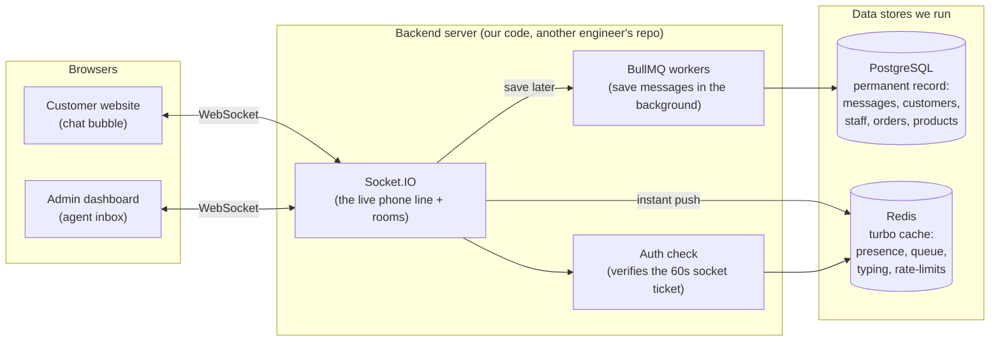
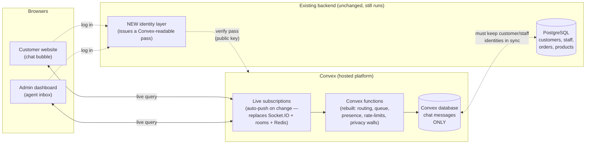

# Live Chat: How It Works Today, and Should We Move It to Convex?

**Date:** 2026-07-11
**Audience:** anyone — no engineering background assumed
**Purpose:** explain, in plain English, how the live chat is built right now across
the three apps, and give an honest read on the idea of rebuilding it on **Convex**.

> There is a deeper, more technical version of this discussion for engineers at
> `admin-blessingcomputers/docs/adr/chat-convex-migration.md`. This document is the
> plain-language companion — read this one first.

---

## 1. The one-paragraph summary

The live chat already works, and it is not a simple toy. It is a genuinely
well-built, already-hardened system spread across three apps: the **customer
website**, the **staff admin dashboard**, and the **backend server**. Moving it to
Convex is technically possible and would delete a lot of plumbing we currently
maintain by hand — but it is a **rebuild, not a move**, it touches a database that
belongs to a different engineer, and the single biggest obstacle is how users prove
who they are (login/security). None of that makes it a bad idea; it makes it a
**deliberate trade-off** that should be decided with eyes open, not a quick win.

---

## 2. What the chat actually does (the feature list)

Before judging any technology, here is everything the current chat already handles.
This is the bar Convex would have to clear.

- A logged-in **customer** opens the chat bubble on the website and starts a
  conversation. (Guests cannot chat — you must be signed in.)
- The message is **routed to a staff member automatically** using a fair
  "round-robin" rota, so agents take turns instead of everyone grabbing the same
  chat.
- If no agent is free, the customer is put in a **waiting queue** and told their
  position. When an agent frees up, waiting chats are handed to them automatically.
- **Typing indicators** ("agent is typing…") in both directions.
- **Read receipts** (unread counters for both sides).
- **Staff presence** — who is online right now, and how many chats each agent is
  currently juggling.
- **Internal notes / mini-CRM** — staff can record lead details (name, budget,
  products discussed, follow-up date, etc.) that the customer must **never** see.
- A private **staff-only chat room** for agents to talk among themselves.
- **Internal messages** inside a customer conversation that only other staff see.
- Assigning a chat to yourself, and **resolving** (ending) a conversation.
- **Messages survive refreshes and reconnects** — history is stored permanently.
- It is built to **not break when the network hiccups**: it reconnects on its own and
  de-duplicates messages so you never see the same message twice.

That last group of points matters a lot. According to the project's own records, this
system has already been through a dedicated "hardening" round — the rough edges
(dropped connections, duplicate messages, stuck "typing" indicators, token-refresh
storms) have already been found and fixed. **We would be replacing tested, battle-worn
code, not prototype code.**

---

## 3. How it's built today (in plain English)

Think of the current system as **three buildings connected by a telephone line**.

### The three apps

| App | Role in chat | Folder |
|-----|--------------|--------|
| **Customer website** | The chat bubble visitors use | `blessingcomputers/` |
| **Admin dashboard** | The agent's inbox / workspace | `admin-blessingcomputers/` |
| **Backend server** | The switchboard in the middle | `BlessingComputerBackend/` |

The two front-end apps don't talk to each other directly. They both talk to the
backend, which acts as the switchboard.

### The "live" telephone line: Socket.IO

Normal websites work like sending letters — you ask, the server answers, done. Chat
needs something closer to a **phone call that stays open**, so messages can arrive the
instant they're sent. The technology doing this is called **Socket.IO** (a WebSocket
library). Both front-end apps open one long-lived connection to the backend and keep
it open the whole time the chat is on screen.

To be robust it starts with a reliable "polling" mode and upgrades to a true
WebSocket once it knows the connection is healthy — so chat keeps working even on
flaky networks.

### The switchboard logic: "rooms"

The backend organises everyone into **rooms** (group phone lines):

- A room per conversation, containing the customer **and** the assigned staff.
- A **staff-only** version of each conversation room, for private notes and internal
  messages the customer must never see.
- One big **staff room** for all agents.
- A **personal line** for each user, for direct notifications.

When someone sends a message, the backend decides which room(s) it belongs in and
pushes it only to the right people. A lot of careful code exists purely to make sure
private staff information never leaks into a room where a customer is listening.

### Where the data lives — and the clever speed trick

This is the most sophisticated part of the current design.

- **PostgreSQL** (the main database) is the permanent record: every message,
  conversation, and note is stored here forever.
- **Redis** (a super-fast in-memory store) is used as a **turbo cache** for anything
  that needs to be instant: who's online, rate-limiting, typing indicators, the
  waiting queue, and quick permission checks.
- **BullMQ** (a background job queue) handles the slow work later.

Here's the trick: when a message is sent, the backend does **not** wait for the
database to save it. It checks a few things in Redis (fast), instantly pushes the
message to the other person, and then quietly hands the "save this to the database"
task to a background worker. The user experiences an instant message; the permanent
save happens a heartbeat later. This is why the chat feels fast even under load.

### The identity/security bridge (remember this — it matters for Convex)

Because the live connection goes to a *different web address* than the main website,
the normal login cookie can't ride along automatically. So the system does something
clever: it mints a **special short-lived (60-second) "socket ticket"** just to open
the chat connection. That ticket is deliberately useless for anything else — you can't
use it to call the regular API. It's a purpose-built, throwaway pass.

Two things about how these passes are signed will become the **central issue** for
Convex, so keep them in mind:

1. The passes are signed with a **shared secret** (called HS256) — like a password
   only our own servers know.
2. There is **no public "verification key"** that an outside service could use to
   check a pass on its own.

### A shared rulebook

All three apps agree on the exact list of message types and their shapes through a
single **shared contract file** (`chat.contract.ts`) that is copied — never
hand-edited — into each app. This keeps the three apps perfectly in sync.

---

## 4. Architecture at a glance: current vs proposed

The two diagrams below say the same thing the words do, but visually. If your
Markdown viewer renders **Mermaid** (GitHub, VS Code, most editors do), they'll draw
themselves. A plain-text version follows each one in case it doesn't.

### Today — we run the "live" plumbing ourselves

**Plain-text version:** Both browsers hold an open WebSocket to our **Socket.IO**
server. That server checks a short-lived ticket, uses **Redis** for anything instant
(presence, queue, typing, rate-limits), pushes the message to the right room right
away, and hands the "save it" job to **background workers** that write to
**PostgreSQL** — the one database that *also* holds customers, staff, and orders. We
own and run every box here.

### Proposed — Convex runs the live plumbing; we keep the rest

**Plain-text version:** Browsers now hold a **live query** to **Convex**, which pushes
updates automatically — so Socket.IO, the rooms, and Redis all disappear. Our business
rules (routing, queue, presence, rate-limits, the privacy walls) are **rebuilt** as
Convex functions, and chat messages live in **Convex's own database**. But the existing
backend doesn't go away: it still runs everything else on **PostgreSQL**, it needs a
**new identity layer** so Convex can verify logins (the red-dashed lines — the hardest
new work), and the two databases must be **kept in sync** (the box-to-box dashed line —
the split-brain cost).

> Read the diagrams together and the trade is clear: the proposed picture **deletes**
> three boxes we run (Socket.IO, Redis, background workers) but **adds** two new
> problems (an identity layer, and two databases that must stay in step) and **rebuilds**
> the business-rule box from scratch.

---

## 5. What Convex is, and why it's tempting

**Convex** is a hosted backend platform where the database is **"live" by design**.
In a normal database you *ask* for data. In Convex, a screen *subscribes* to data, and
whenever that data changes, Convex **automatically pushes the update** to every screen
watching it. No manual phone line, no rooms, no broadcasting logic — the database
itself does the pushing.

For a chat app that is a genuinely great fit, and here's the honest upside:

- **A huge amount of our hand-written plumbing simply disappears.** The Socket.IO
  connection management, the rooms, the broadcast logic, the reconnect-and-de-duplicate
  code, the typing-indicator timers — much of this becomes unnecessary because Convex
  handles "push the latest data to whoever's looking" for us.
- **We could retire multiple moving parts.** Potentially no more Redis cache, no more
  BullMQ background workers, and no more running/scaling a Socket.IO server ourselves.
  Fewer things to run means fewer things that break at 2 a.m.
- **Reconnects and live updates are Convex's job, not ours.** The exact category of bug
  the team already spent a hardening cycle fixing is handled by the platform.
- **The front-end code gets simpler and shorter.**

If we were building this chat from a blank page today, Convex would be a very
reasonable — arguably better — starting point.

---

## 6. The catch: it's a rebuild, and three things make it hard

The upside is real. But "Convex is socket by design" describes the *destination*, not
the *journey*. Here is what the journey actually involves.

### Catch #1 — Login/security is the big one 🔴

Convex needs to independently verify who a user is. It does this using a **public
verification key** (an open standard called JWKS / OIDC), the way a bouncer checks an
ID against a known template.

Our system doesn't work that way. As noted above, our passes are signed with a
**shared secret and there is no public verification key at all.** Convex literally
cannot check today's passes.

So before Convex can trust a single user, the backend team must build a **new
identity-issuing layer**: either mint a new kind of pass in a format Convex
understands, or stand up a public key service. This is real, security-sensitive work —
the kind you cannot rush, because mistakes here are login and data-access bugs. **This
is the largest single task in the whole migration**, and it exists before any chat
feature is rebuilt.

### Catch #2 — The chat data would live in a second, separate database 🟠

Right now, chat lives in the **same PostgreSQL database** as customers, staff, orders,
and products. A conversation can point directly at a real customer record. Everything
is in one place.

Convex brings **its own database**. If chat moves to Convex, chat data leaves the main
database and lives somewhere else. That creates a **split-brain problem**: every
conversation still needs to know which customer and which staff member it belongs to,
but those records stay in PostgreSQL. We'd have to **keep identities in sync between
two databases**, and any report that joins "chats" with "customers" or "orders"
becomes harder because the data no longer sits together.

Crucially (per the project's own notes), **the backend is a different engineer's
repository.** The whole rest of that backend — orders, payments, products, auth —
runs on PostgreSQL and isn't going anywhere. So Convex wouldn't *replace* the backend;
it would sit **alongside** it as a second system to keep in step. That's added
coordination, not removed complexity.

### Catch #3 — The "smart" features must be rebuilt, not copied 🟠

The nice behaviours from the feature list don't come for free on Convex. Each has to
be re-implemented in Convex's own way:

- **Round-robin agent assignment** (the fair rota) — rebuild.
- **The waiting queue and "your position is #3"** — rebuild.
- **Presence** (who's online, how many chats each agent has) — rebuild.
- **Rate limiting** (stopping message spam) — rebuild.
- **The strict privacy walls** (internal notes and staff-only messages never reaching
  a customer) — must be re-proven from scratch on the new system. This is the scariest
  one to get wrong, because a mistake means leaking private notes to a customer.

None of these are impossible on Convex. But "Convex handles real-time for us" does
**not** mean "Convex handles our business rules for us." Those we still own.

---

## 7. Honest scorecard

| Question | Verdict |
|----------|---------|
| Is Convex a good fit for chat *in principle*? | **Yes.** Live-by-design is exactly what chat wants. |
| Would it delete a lot of code we maintain by hand? | **Yes** — real, lasting simplification. |
| Is the current system bad or broken? | **No.** It's well-built and already hardened. |
| Is this a quick swap? | **No. It's a ground-up rebuild** of a working system. |
| What's the hardest part? | **Login/security** — Convex can't verify our current passes; a new identity layer must be built first. |
| Any hidden structural cost? | **Yes** — chat data splits into a second database that must be kept in sync with the main one (which belongs to another engineer). |
| Do the smart features come free? | **No** — routing, queue, presence, rate-limits, and the privacy walls are all rebuilt and re-tested. |

---

## 8. Plain-language recommendation

**Don't rush, and don't frame it as "moving" the chat — frame it as rebuilding it.**

Convex is a legitimately strong platform and, for a *brand-new* chat, might well be the
better choice. But we are not starting from scratch; we're weighing **replacing a
working, already-hardened system** against the appeal of cleaner future plumbing. That
trade-off deserves a small, cheap experiment before any commitment:

1. **Prove the login story first.** Before touching chat features, have the backend
   engineer confirm exactly how a Convex-compatible identity pass would be issued from
   the existing system. If that turns out to be hard or risky, the whole idea stalls
   here — so test it first, when it's cheapest to walk away.
2. **Decide where chat data should live** — and who keeps the two databases in sync.
   Get the backend engineer's agreement, since it's their repository and their database.
3. **Build one tiny end-to-end slice on Convex** — a customer sends a message, a staff
   member sees it live, with real logins. No queue, no presence, no notes. Just prove
   the round-trip and the security work.
4. **Only then** estimate the full rebuild (including re-proving the privacy walls) and
   compare it honestly against the cost of simply continuing to run the current system.

**Bottom line:** this is a reasonable direction with a real payoff — *less* infrastructure
to babysit long-term — but it is a **rebuild of something that already works**, gated by
a non-trivial security task and a database-split decision that involves another team.
Green-light a small proof-of-concept, not a full migration, and let the login
experiment in step 1 make the decision for us.
